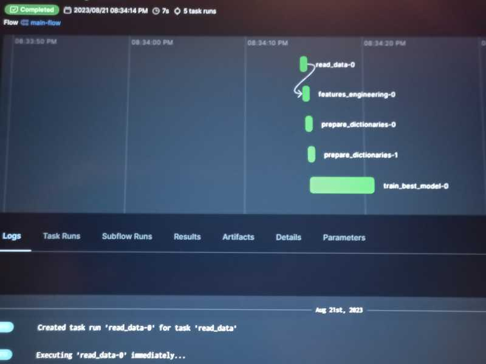

# e2e-bike-count-predictor

A bike-sharing prediction service is a useful tool to plan daily supply of bikes. The main goal is to create an end to end service with the main characteristics required in a production environment: possibility of monitoring in production with possible consequent refinement of the prediction model, reproducibility of the entire workflow, quality checks and automation.

## Problem Description

### Overview

The problem is assisting a bike-sharing activity in taking decisions about the supply of bikes over time, to promptly react to demand fluctuations. The specific objective is to predict the hourly count of rented bikes. For this project, the predictions are based on historical data from the bike-sharing system of the city of Seoul, in South Korea. Ddareungi (Seoul Bike) is Seoul, South Korea’s bike-sharing system. Ddareungi started as a leisure activity but has transformed into a popular means of transportation. This will be treated as a regression problem.

### Data Source

There is a dataset originally extracted from the official Seoul Open Data Plaza and that was already used in scientific research activities (see references). It is publicly available in the <strong>UCI machine learning Repository</strong>:

*Seoul Bike Sharing Demand. (2020). UCI Machine Learning Repository.* [https://doi.org/10.24432/C5F62R](https://doi.org/10.24432/C5F62R).

### Dataset description

It is a tabular dataset, comprising **8760 rows** and <strong>14 columns</strong>. Here below the name and short explanation of each column (variable):

* Date : year-month-day
* Rented Bike count : Count of bikes rented at each hour
* Hour : Hour of he day
* Temperature : Temperature in Celsius
* Humidity : %
* Windspeed : m/s
* Visibility : 10m
* Dew point temperature : Temperature in Celsius
* Solar radiation : MJ/m2
* Rainfall : mm
* Snowfall : cm
* Seasons : Winter, Spring, Summer, Autumn
* Holiday : Holiday/No holiday
* Functional Day : NoFunc(Non Functional Hours), Fun(Functional hours)

The data stored in a row are values for a fixed hour of the day. The dataset spans from December, 1, 2017 to November, 30, 2018. The **Rented Bike count** is the target variable in this problem.

### References

* Sathishkumar V E & Yongyun Cho (2020). A rule-based model for Seoul Bike sharing demand prediction using weather data, <em>European Journal of Remote Sensing</em>, DOI:10.1080/22797254.2020.1725789
* Ngo, T.T., Pham, H.T., Acosta, J.G., & Derrible, S. (2022). Predicting Bike-Sharing Demand Using Random Forest. <em>Journal of Science and Transport Technology</em>.

### 

## Development Environment

The whole development has been done in an isolated virtual environment. I have chosen [Poetry](https://python-poetry.org/) as Python dependency manager. For better reproducibility, all the employed libraries are recorded with pinned versions. Among the best coding practices adopted are the usage of linters, formatters and pre-commit hooks

## Preparing the Data and training a baseline model

The whole data preparation, the Exploratory Data Analysis and the definition of a baseline model are done inside the `bike_count.ipynb` notebook.
I have held out part of the dataset in order to simulate a monitoring task during the deployment in production. In particular, from the total 8760 samples, I have stored 6576 samples from Winter, Spring and Summer in `ref_data.csv` and the remaining 2184 samples (Autumn) have been stored in `curr_data.csv`.
To simulate weekly data monitoring, the curr\_data samples have been further divided into 13 batches (each batch containing samples of a week, i.e. 24x7=168 samples), and each batch has been saved to a csv file (`curr_data_week01.csv`, `curr_data_week02.csv`,...)

## Tracking the training experiments

All the experiments are contained in the training folder and they are tracked using MLFlow. `experiments.py` is a script obtained from a refactored version of the bike\_count notebook. It containes runs of the mlflow experiment named <em>'bike-count-experiment'</em>. While `train_xbg.py` contains runs of the same mlflow experiment, created by fine tuning the xgb model with the aid of the hyperopt library. In the end, the xgboost model with best parameters is chosen as best model due to its performance in terms of rmse and model file dimension.

Orchestrate the train pipeline
For the choiced best\_model a script was created, named train\_best\_flow.py, where the training pipeline for the model with the best params is executed as flow orchestrated by Prefect. Once executed, here below is a screenshot of the Prefect dashboard.

As a second product of the script, the pipeline parameters are registered in the mlflow dashboard as a new run of the bike-count-experiment
